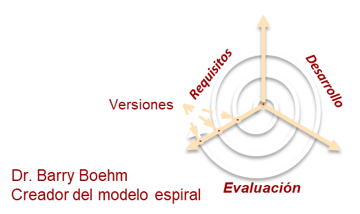
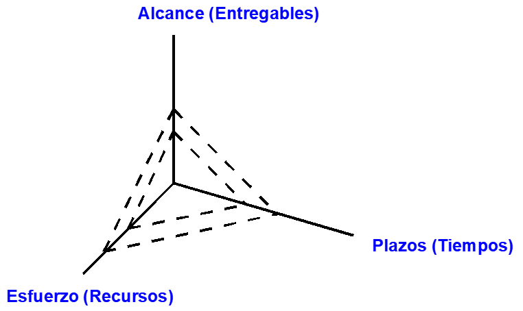
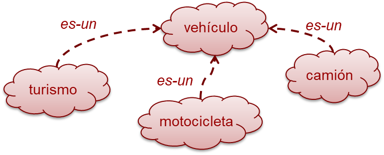
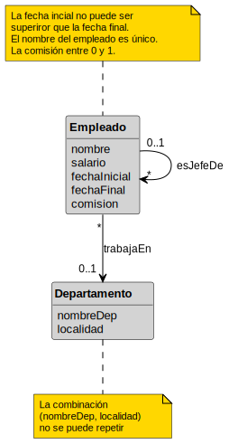

<!-- _class: title -->

# Guía del tema `dr-iissi` 

## Plantillas y patrones de maquetación Marp

### Referencia visual del tema

---

<!-- _class: content -->

# Esta guía incluye

- Sección 1. Tipografía del tema y de código
- Sección 2. Layouts base (`default`, `content`, `three-col`, `two-col*`)
- Sección 3. Centrado vertical (`v-align`)
- Sección 4. Código (`mr/sql`) y fórmulas
- Sección 5. Banco de pruebas visual (A...J)
- Sección 6. Casos realistas reutilizables para T1...T12
- Sección 7. Anexo mixto (K...N)

---
<!-- _class: default -->

# Regla de columnas (actual)

Para `two-col` y variantes:

1. Usa `*** left ***` para iniciar columna izquierda.
2. Usa `*** right ***` para iniciar columna derecha.
3. Para `three-col`, añade también `*** center ***`.
4. No uses `<hr/>` en layouts de columnas.

Opcional: añade clase `v-align` para centrar verticalmente esa slide.

---

<!-- _class: content -->

# Navegación de la guía

- **Sección 1. Tipografía del tema y de código**
- Sección 2. Layouts base
- Sección 3. Centrado vertical (`v-align`)
- Sección 4. Código (`mr/sql`) y fórmulas

---

<!-- _class: default font-roboto -->

# Tipografía de tema: default (Roboto)

Este slide usa la fuente por defecto del tema (`Roboto`).

- Texto de prueba con acentos: áéíóú ñ
- **Negrita de prueba**
- *Cursiva de prueba*
- `Código inline de prueba`

---

<!-- _class: default font-lato -->

# Tipografía de tema: Lato

Este slide fuerza `Lato` a nivel de diapositiva.

- Texto de prueba con acentos: áéíóú ñ
- **Negrita de prueba**
- *Cursiva de prueba*
- `Código inline de prueba`

---

<!-- _class: default font-roboto-condensed -->

# Tipografía de tema: Roboto Condensed

Este slide fuerza `Roboto Condensed` a nivel de diapositiva.

- Texto de prueba con acentos: áéíóú ñ
- **Negrita de prueba**
- *Cursiva de prueba*
- `Código inline de prueba`

---

<!-- _class: default font-source-sans-3 -->

# Tipografía de tema: Source Sans 3

Este slide fuerza `Source Sans 3` a nivel de diapositiva.

- Texto de prueba con acentos: áéíóú ñ
- **Negrita de prueba**
- *Cursiva de prueba*
- `Código inline de prueba`

---

<!-- _class: default font-caveat -->

# Tipografía de tema: Caveat

Este slide fuerza `Caveat` a nivel de diapositiva para ver una alternativa manuscrita.

- Texto de prueba con acentos: áéíóú ñ
- Frase larga para inspeccionar ritmo y legibilidad en líneas extensas.
- **Negrita de prueba**
- *Cursiva de prueba*
- `Código inline de prueba`

---

<!-- _class: default -->

# Fuente de código: default (Consolas/Marp)

Este ejemplo usa la pila monoespaciada por defecto del tema.

```sql default
-- Ranking de empleados por salario dentro de cada departamento
SELECT
  d.nombre AS departamento,
  e.id_emp,
  e.nombre,
  e.salario,
  ROW_NUMBER() OVER (
    PARTITION BY d.id_dept
    ORDER BY e.salario DESC
  ) AS orden_salario
FROM Empleado e
JOIN Departamento d ON d.id_dept = e.id_dept
WHERE e.salario IS NOT NULL
ORDER BY d.nombre, orden_salario;
```

---

<!-- _class: default -->

# Fuente de código: JetBrains Mono (local)

Misma estructura de código para comparar legibilidad, espaciado y peso.

```mr jetbrains
-- Modelo relacional de ejemplo
Empleado(PK id_emp, nombre, salario, FK id_dept null)
Departamento(PK id_dept, nombre AK, presupuesto)
Proyecto(PK id_proy, nombre, FK id_dept)
Asignacion(PK id_emp, PK id_proy, horas, fecha_inicio)
```

```sql jetbrains
SELECT e.nombre, p.nombre, a.horas
FROM Asignacion a
JOIN Empleado e ON e.id_emp = a.id_emp
JOIN Proyecto p ON p.id_proy = a.id_proy
WHERE a.horas >= 20
ORDER BY a.horas DESC, e.nombre;
```

---

<!-- _class: default -->

# Cómo cambiar la fuente en bloques de código

La selección se hace en el *fence* y la aplica `marp-engine.js`:

- `default` o `consolas` para la fuente monoespaciada por defecto.
- `jetbrains` o `jb` para `JetBrains Mono` local del repositorio.

Ejemplos:

` ```sql default `  
`SELECT * FROM Empleado;`  
` ``` `

` ```mr jetbrains `  
`Empleado(PK id_emp, nombre)`  
` ``` `

---

<!-- _class: content -->

# Navegación de la guía

- Sección 1. Tipografía del tema y de código
- **Sección 2. Layouts base**
- Sección 3. Centrado vertical (`v-align`)
- Sección 4. Código (`mr/sql`) y fórmulas

---

<!-- _class: default -->

# Layout: default

Transparencia estándar con una sola columna de contenido.

- Punto uno del contenido
- Punto dos del contenido
  - Subpunto A
  - Subpunto B
- Punto tres del contenido

---

<!-- _class: default -->

# Headings: h2, h3, h4

## Esto es un h2 (centrado)

### Esto es un h3 (centrado, más pequeño)

#### Esto es un h4 (centrado, aún más pequeño)

Texto de párrafo normal bajo los headings.

---

<!-- _class: content -->

# Layout: content (agenda)

- Introducción al tema
- Fundamentos teóricos
- Metodología y herramientas
- Casos de estudio
- Conclusiones y trabajo futuro

---
<!-- _class: default  -->

# Layout: default con una imagen




---
<!-- _class: default  -->

# Layout: default con una imagen y texto

- Ejemplo de lista ANTES DE IMAGEn:
  - Uno
  - dos
  - tres


---
<!-- _class: two-col -->

# Layout: two-col (dos columnas)

*** left ***

**Columna izquierda**

Contenido de la primera columna.

- Item A
- Item B
- Item C

*** right ***

**Columna derecha**

Contenido de la segunda columna.

- Item D
- Item E
- Item F

---

<!-- _class: three-col -->

# Layout: three-col (tres columnas)

*** left ***

**Primera columna**

Texto de la columna 1.

*** center ***

**Segunda columna**

Texto de la columna 2.

*** right ***

**Tercera columna**

Texto de la columna 3.

---
<!-- _class: three-col -->

# Layout: three-col (texto + código + imagen)

*** left ***

Resumen rápido del bloque:

- Contexto
- Regla
- Conclusión

*** center ***

```sql
SELECT nombre, salario
FROM Empleados
WHERE salario > 2000;
```

*** right ***


---
<!-- _class: three-col v-align -->

# Layout: three-col + v-align

*** left ***

Texto centrado verticalmente.

*** center ***

```mr
Pedido(PK id_ped, FK id_cli)
Cliente(PK id_cli, nombre)
```

*** right ***



---
<!-- _class: content -->

# Navegación de la guía

- Sección 1. Tipografía del tema y de código
- Sección 2. Layouts base
- **Sección 3. Centrado vertical (`v-align`)**
- Sección 4. Código (`mr/sql`) y fórmulas

---
<!-- _class: default v-align -->

# Test v-align: default

Este bloque debería aparecer centrado verticalmente en la traspa.

---
<!-- _class: content v-align -->

# Test v-align: content

- Elemento 1
- Elemento 2
- Elemento 3

---
<!-- _class: two-col v-align -->

# Test v-align: two-col

*** left ***

Texto en la columna izquierda.

*** right ***


---
<!-- _class: two-col-3-7 v-align -->

# Test v-align: two-col-3-7

*** left ***

Texto corto.

*** right ***

```sql
SELECT *
FROM Empleados
WHERE salario > 2000;
```

---
<!-- _class: two-col-7-3 v-align -->

# Test v-align: two-col-7-3

*** left ***

```mr
Empleado(PK id_emp, nombre, FK id_dept)
Departamento(PK id_dept, nombre)
```

*** right ***


---

<!-- _class: two-col-3-7 -->

# Layout: two-col-3-7 (30% / 70%)

*** left ***

Columna izquierda (30%).

Más contenido izquierda.

*** right ***

Columna derecha (70%) con más espacio para texto detallado.

- Punto detallado uno
- Punto detallado dos
- Punto detallado tres

---

<!-- _class: two-col-7-3 -->

# Layout: two-col-7-3 (70% / 30%)

*** left ***

Columna izquierda (70%) con el contenido principal.

- Descripción larga del concepto principal
- Más información relevante
- Conclusión parcial

*** right ***

Columna derecha (30%).

Notas complementarias.

---

<!-- _class: two-col -->

# Layout: two-col (50/50)

*** left ***

Texto a la arriba de la imagen.


*** right ***

- Característica A
- Característica B

---

<!-- _class: two-col-3-7 -->

# Layout: two-col-3-7 (30% img / 70% texto)

*** left ***



Texto debajo de la imagen

*** right ***

- Punto uno con explicación detallada
- Punto dos con más información
- Punto tres

---
<!-- _class: two-col -->

# Layout: two-col (50/50)

*** left ***

Texto a la izquierda de la imagen.

- Característica A
- Característica B

*** right ***


---

<!-- _class: two-col-7-3 -->

# Layout: two-col-7-3 (70% texto / 30% img)

*** left ***

Texto principal con más espacio.

- Punto uno
- Punto dos
- Punto tres

*** right ***


---

<!-- _class: content -->

# Navegación de la guía

- Sección 1. Tipografía del tema y de código
- Sección 2. Layouts base
- Sección 3. Centrado vertical (`v-align`)
- **Sección 4. Código (`mr/sql`) y fórmulas**

---

<!-- _class: default -->

# Bloques de código: mr (modelo relacional)

Escenario mínimo con claves y restricciones para validar resaltado en `mr`.

```mr
-- Catálogo base de RRHH
Empleado(PK id_emp, nombre, apellidos, salario, FK id_dept null)
Departamento(PK id_dept, nombre AK, presupuesto)
Proyecto(PK id_proy, nombre, FK id_dept)
Asignacion(PK id_emp, PK id_proy, horas, fecha_inicio)
```

---

<!-- _class: default -->

# Bloques de código: sql

Consulta más larga para revisar sangrado, saltos de línea y legibilidad.

```sql
SELECT
  e.id_emp,
  e.nombre,
  d.nombre AS departamento,
  e.salario
FROM Empleado e
JOIN Departamento d ON e.id_dept = d.id_dept
WHERE e.salario > 30000
  AND d.presupuesto >= 100000
ORDER BY d.nombre, e.salario DESC, e.nombre;
```

---

<!-- _class: two-col-3-7 -->

# mr + sql combinados en two-col-3-7

*** left ***

```mr
Empleado(PK id_emp, nombre, salario, FK id_dept null)
Departamento(PK id_dept, nombre AK, presupuesto)
Asignacion(PK id_emp, PK id_proy, horas)
```

*** right ***

```sql
SELECT
  e.nombre,
  d.nombre AS departamento,
  SUM(a.horas) AS total_horas
FROM Empleado e
JOIN Departamento d ON d.id_dept = e.id_dept
LEFT JOIN Asignacion a ON a.id_emp = e.id_emp
WHERE e.id_dept IS NOT NULL
GROUP BY e.nombre, d.nombre
HAVING SUM(a.horas) > 10
ORDER BY total_horas DESC, e.nombre;
```

---
<!-- _class: content -->

# Navegación de la guía

- Sección 1. Tipografía del tema y de código
- Sección 2. Layouts base
- Sección 3. Centrado vertical (`v-align`)
- **Sección 4. Código (`mr/sql`) y fórmulas**
- Sección 5. Banco de pruebas visual (A...J)
- Sección 6. Casos realistas (T1...T12)
- Sección 7. Anexo mixto (K...N)

---
<!-- _class: default -->
# Fórmulas

$$
\Proj_{\text{columnas}}\!\left(\Sel_{\text{condicion}}\!\left(T_1 \times T_2 \times \cdots \times T_n\right)\right)
$$
```sql
SELECT < lista de columnas >
	FROM    < T1, T2,.. ,Tn >
	WHERE  < condición >
```

$$
\Proj_{\text{nombre},\text{salario}}\!\left(\Sel_{\text{salario}<2000}(Empleados)\right)
$$
```sql
SELECT nombre, salario
FROM Empleados
WHERE salario < 2000;
```
$$
\Group^{\text{P.de},\,\mathrm{count}(\text{Ped.id})}_{\text{P.de}}\!\left(Ped \NatJoin P\right)
$$

---
<!-- _class: default -->
# Mini tutorial: macros AR (KaTeX)

Escribe las fórmulas en bloque con `$$ ... $$` y usa estas macros:

- `\Proj_{...}` proyección
- `\Sel_{...}` selección
- `\Ren_{...}` renombrado
- `\Group^{...}_{...}` agrupación/aggregación
- `\NatJoin`, `\JoinBy{...}` joins
- `\Union`, `\Inter`, `\Diff` operadores de conjuntos

---
<!-- _class: default -->
# Mini tutorial: macros AR (KaTeX)

Ejemplos de escritura:

```tex
\Proj_{\text{nombre},\text{salario}}(Empleados)
\Sel_{\text{salario}>2000}(Empleados)
\Ren_{\text{Emp}}(Empleados)
\Group^{\mathrm{count}(Ped.id)}_{\text{P.de}}(Ped \NatJoin P)
\Sel_{\text{Emp.id}=\text{Dept.id}}(Emp \JoinBy{\text{id}} Dept)
```

---
<!-- _class: default -->
# Mini tutorial: macros AR (KaTeX)

Renderizado:

$$
\Proj_{\text{nombre},\text{salario}}(Empleados)
$$
$$
\Sel_{\text{salario}>2000}(Empleados)
$$
$$
\Ren_{\text{Emp}}(Empleados)
$$
$$
\Group^{\mathrm{count}(Ped.id)}_{\text{P.de}}(Ped \NatJoin P)
$$
$$
Emp \Union Dept,\quad Emp \Inter Dept,\quad Emp \Diff Dept
$$

---
<!-- _class: default -->
# Mini tutorial: caracteres especiales / iconos (win + .)

Ejemplo de flechas ➡️ ⬅️ 

Ejemplo de iconos: 🎯🍽️🍴🧾

Ejemplo de AR: π σ ρ ≥ γ ∧ ∨ 

---
<!-- _class: content -->

# Navegación de la guía

- Sección 1. Tipografía del tema y de código
- Sección 2. Layouts base
- Sección 3. Centrado vertical (`v-align`)
- Sección 4. Código (`mr/sql`) y fórmulas
- **Sección 5. Banco de pruebas visual (A...J)**
- Sección 6. Casos realistas (T1...T12)
- Sección 7. Anexo mixto (K...N)

---
<!-- _class: default -->
# Test de columnas: imágenes + texto

Objetivo: validar que NO haya recorte en columnas.

Casos cubiertos:

- Imagen en izquierda / derecha / ambas columnas.
- Texto arriba, debajo y arriba+debajo de la imagen.
- Layouts `two-col-3-7` y `two-col-7-3`.
- Casos mixtos `imagen + bloque de código`.

---
<!-- _class: two-col-3-7 -->
# Test A — Imagen izquierda (solo imagen)

*** left ***


*** right ***

Texto normal en la columna derecha para forzar reparto de altura.

- Línea 1
- Línea 2
- Línea 3

---
<!-- _class: two-col-3-7 -->
# Test B — Imagen izquierda + texto arriba

*** left ***

Texto arriba (izquierda).


*** right ***

Columna derecha de control.

---
<!-- _class: two-col-3-7 -->
# Test C — Imagen izquierda + texto debajo

*** left ***


Texto debajo (izquierda).

*** right ***

Columna derecha de control.

---
<!-- _class: two-col-3-7 -->
# Test D — Imagen izquierda + texto arriba y debajo

*** left ***

Texto arriba (izquierda).


Texto debajo (izquierda).

*** right ***

Columna derecha de control.

---
<!-- _class: two-col-7-3 -->
# Test E — Imagen derecha (solo imagen)

*** left ***

Texto normal en la columna izquierda para forzar reparto de altura.

- Línea 1
- Línea 2
- Línea 3
- Línea 4

*** right ***


---
<!-- _class: two-col-7-3 -->
# Test F — Imagen derecha + texto arriba y debajo

*** left ***

Texto en la izquierda.

*** right ***

Texto arriba (derecha).


Texto debajo (derecha).

---
<!-- _class: two-col-3-7 -->
# Test G — Imagen en ambas columnas

*** left ***


Texto debajo (izquierda).

*** right ***

Texto arriba (derecha).


---
<!-- _class: two-col-7-3 -->
# Test H — Imagen en ambas columnas (invertido)

*** left ***

Texto arriba (izquierda).


*** right ***


Texto debajo (derecha).

---
<!-- _class: two-col -->
# Test I — two-col 50/50, dos imágenes + texto

*** left ***

Texto arriba (izquierda).


Texto debajo (izquierda).

*** right ***

Texto arriba (derecha).


Texto debajo (derecha).

---
<!-- _class: two-col -->
# Test J — two-col 50/50, dos imágenes + texto (invertido)

*** left ***

Texto arriba (izquierda).


Texto debajo (izquierda).

*** right ***

Texto arriba (derecha).


Texto debajo (derecha).

---
<!-- _class: content -->

# Navegación de la guía

- Sección 1. Tipografía del tema y de código
- Sección 2. Layouts base
- Sección 3. Centrado vertical (`v-align`)
- Sección 4. Código (`mr/sql`) y fórmulas
- Sección 5. Banco de pruebas visual (A...J)
- **Sección 6. Casos realistas (T1...T12)**
- Sección 7. Anexo mixto (K...N)

---
<!-- _class: default -->
# Casos realistas T1–T12 (plantillas base)

Objetivo: tener transparencias de referencia con contenido realista de los temas.

Cobertura:
- Slides con imagen completa.
- Slides en `two-col`, `two-col-3-7` y `two-col-7-3`.
- Bloques de código `mr/sql`.
- Fórmulas (KaTeX / AR).

---
<!-- _class: two-col -->
# T1 · Introducción al software

*** left ***

La crisis del software aparece cuando:

- aumenta el tamaño de los proyectos,
- crece la complejidad técnica,
- no hay procesos de ingeniería claros.

*** right ***


---
<!-- _class: two-col-3-7 -->
# T2 · Metodología Scrum

*** left ***

Roles y artefactos principales:

- `Product Owner`
- `Scrum Master`
- `Sprint Backlog`

*** right ***


---
<!-- _class: default -->
# T3 · Componentes de un SI

Un sistema de información combina personas, procesos, datos y tecnología.


---
<!-- _class: default -->
# T4 · Protección de datos

Panorama global de normativas de protección de datos.


---
<!-- _class: two-col-7-3 -->
# T5 · Historias de usuario

*** left ***

Formato base:

> Como `<rol>`, quiero `<objetivo>` para `<beneficio>`.

Criterios de aceptación:

- medibles,
- verificables,
- orientados al valor.

*** right ***


---
<!-- _class: two-col -->
# T6 · Modelo conceptual UML

*** left ***

Notación de clases, atributos y asociaciones en UML.

*** right ***


---
<!-- _class: default -->
# T7 · Dependencias funcionales

Grafo para analizar claves candidatas y normalización.


---
<!-- _class: two-col-3-7 -->
# T8 · Transformación MC → MR (1:n)

*** left ***

```mr
Departamento(id_dep, nombre)
Empleado(id_emp, nombre, FK id_dep)
```

*** right ***


---
<!-- _class: default -->
# T9 · Álgebra relacional (join)

$$
\Proj_{\text{nombre},\text{salario}}
\left(
  Empleado \JoinBy{\text{Empleado.id\_dept}=\text{Departamento.id\_dept}} Departamento
\right)
$$


---
<!-- _class: two-col-3-7 -->
# T10 · SQL DDL + modelo

*** left ***

```sql
CREATE TABLE departamento (
  id_dept INT PRIMARY KEY,
  nombre  VARCHAR(40) NOT NULL
);
```

*** right ***


---
<!-- _class: two-col -->
# T11 · Procedimientos almacenados

*** left ***

```sql
DELIMITER //
CREATE PROCEDURE p_raise_fee(IN p_pct DECIMAL(4,2))
BEGIN
  UPDATE empleado
  SET fee = fee * (1 + p_pct / 100);
END//
DELIMITER ;
```

*** right ***


---
<!-- _class: two-col-7-3 -->
# T12 · Estados de transacción

*** left ***

Estados típicos en el SGBD:

- `Active`
- `Partially_Committed`
- `Committed`
- `Aborted`
- `Finished`

*** right ***


---
<!-- _class: content -->

# Navegación de la guía

- Sección 1. Tipografía del tema y de código
- Sección 2. Layouts base
- Sección 3. Centrado vertical (`v-align`)
- Sección 4. Código (`mr/sql`) y fórmulas
- Sección 5. Banco de pruebas visual (A...J)
- Sección 6. Casos realistas (T1...T12)
- **Sección 7. Anexo mixto (K...N)**

---
<!-- _class: two-col-3-7 -->
# Test K — Imagen izquierda + código derecha

*** left ***



*** right ***

```mr
-- Intensión relacional
Departamentos = {departamentoId, nombreDep, localidad}
	PK(departamentoId)
	AK(nombreDep, localidad)

Empleados = {empleadoId, departamentoId, jefeId,
   nombre, salario, fechaInicial, fechaFinal, comision}
	PK(empleadoId)
	FK(departamentoId)/Departamentos
	FK(jefeId)/Empleados
```

Con algo de código por debajo.

---
<!-- _class: two-col-7-3 -->
# Test L — Código izquierda + imagen derecha

*** left ***

Texto arriba (izquierda).

```sql
CREATE TABLE cuentas (
  numcta SMALLINT KEY,
  titular VARCHAR(20) NOT NULL,
  saldo DECIMAL(9,2) NOT NULL,
  CHECK (saldo >= 0)
);
```

Texto debajo (izquierda).

*** right ***


---
<!-- _class: two-col -->
# Test M — two-col 50/50, imagen + código

*** left ***

Texto arriba (izquierda).


Texto debajo (izquierda).

*** right ***

Texto arriba (derecha).

```mr
Pedido(id_ped, fecha, FK id_cli)
Cliente(id_cli, nombre, ciudad)
```

Texto debajo (derecha).

---
<!-- _class: two-col -->
# Test N — two-col 50/50, código + imagen (invertido)

*** left ***

Texto arriba (izquierda).

```sql
SELECT e.nombre, d.nombre
FROM Empleado e
JOIN Departamento d ON d.id_dept = e.id_dept;
```

Texto debajo (izquierda).

*** right ***

Texto arriba (derecha).


Texto debajo (derecha).
