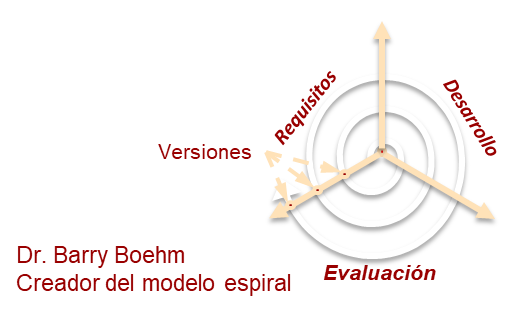
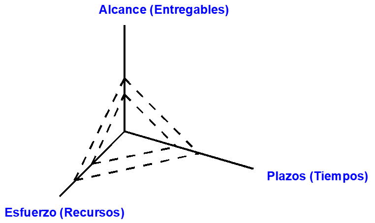
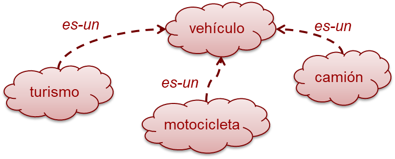
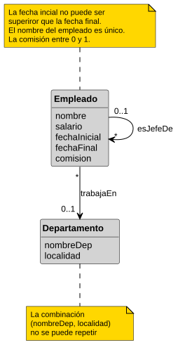

<!-- _class: title -->

# `dr-iissi` Theme Guide

## Usage reference and visual regression deck

### IISSI Marp theme

---

<!-- _class: content -->

# What this deck is for

- Learn how to use the `dr-iissi` theme in real slides.
- See the supported layout patterns and content conventions.
- Verify typography, code blocks, math, image framing, footer, and pagination.
- Use the later sections as a visual regression deck after theme or engine changes.

---

<!-- _class: default -->

# Quick start

Use the theme with Marp CLI:

```bash
marp --theme-set ./css/dr-iissi.css --engine ./scripts/marp-engine.js slide.md --pdf
```

Recommended front matter in a deck that lives outside `marp-theme/`:

```yaml
---
marp: true
theme: dr-iissi
marp-theme-rel-dir: ../../marp-theme
paginate: true
size: 16:9
image-box: false
---
```

---

<!-- _class: default -->

# Theme-specific front matter

`marp-theme-rel-dir` tells the engine where theme assets live relative to the current markdown file.

- In this guide the value is `..`
- In `iissi-1/t*/...md` files the value is `../../marp-theme`
- Use a relative path so PDF builds stay portable across machines

`image-box` controls whether images use the default framed box style.

- Use `image-box: false` to disable the image box for the whole deck
- Omit it, or use `image-box: true`, to keep the default behavior

By default, images use a very subtle granate frame.

If the path is wrong, background images and local fonts may not resolve during render.

---

<!-- _class: default -->

# Column marker rules

For `two-col`, `two-col-3-7`, `two-col-7-3`, and `three-col`:

1. Use `*** left ***` to start the left column.
2. Use `*** right ***` to start the right column.
3. Use `*** center ***` only in `three-col`.
4. Do not use `<hr/>` inside column layouts.

Optional: add `v-align` to vertically center the slide body.

The engine inserts the needed blank line after each column marker automatically, so the next block can start immediately.

---

<!-- _class: content -->

# Guide map

- **Section 1. Typography and code fonts**
- Section 2. Base layouts and images
- Section 3. Vertical alignment
- Section 4. `mr`, `sql`, and KaTeX
- Section 5. Visual regression cases A-J
- Section 6. Realistic topic examples T1-T12
- Section 7. Mixed regression cases K-N

---

<!-- _class: default font-roboto -->

# Theme font: default (`Roboto`)

This slide uses the default theme font.

- Accents and symbols: áéíóú ñ ç
- **Bold sample**
- *Italic sample*
- `Inline code sample`

---

<!-- _class: default font-lato -->

# Theme font override: `Lato`

Use slide classes such as `font-lato` when a deck needs a different tone without changing the whole theme.

- Paragraph rhythm sample
- **Bold sample**
- *Italic sample*
- `Inline code sample`

---

<!-- _class: default font-roboto-condensed -->

# Theme font override: `Roboto Condensed`

This variant is useful for denser titles or compact text blocks.

- Narrower letterforms
- Good for labels and summaries
- `Inline code sample`

---

<!-- _class: default font-source-sans-3 -->

# Theme font override: `Source Sans 3`

Use this slide to validate the local variable font and italic face.

- Normal text sample
- *Italic sample*
- **Bold sample**

---

<!-- _class: default font-caveat -->

# Theme font override: `Caveat`

This slide is intentionally distinctive so font loading issues are obvious.

- Handwritten tone sample
- Long enough sentence to inspect rhythm and contrast.
- **Bold sample**
- *Italic sample*

---

<!-- _class: default -->

# Code font: default stack

Default code blocks use the theme monospace stack.

```sql default
SELECT
  d.nombre AS departamento,
  e.id_emp,
  e.nombre,
  e.salario,
  ROW_NUMBER() OVER (
    PARTITION BY d.id_dept
    ORDER BY e.salario DESC
  ) AS orden_salario
FROM Empleado e
JOIN Departamento d ON d.id_dept = e.id_dept
WHERE e.salario IS NOT NULL
ORDER BY d.nombre, orden_salario;
```

---

<!-- _class: default -->

# Code font: `JetBrains Mono`

The engine supports a local JetBrains Mono variant through the fence info string.

```mr-table jetbrains
Empleado = { id_emp, nombre, salario, id_dept null }
    PK(id_emp)
    FK(id_dept) / Departamento
Departamento = { id_dept, nombre, presupuesto }
    PK(id_dept)
    AK(nombre)
```

```sql jetbrains
SELECT e.nombre, p.nombre, a.horas
FROM Asignacion a
JOIN Empleado e ON e.id_emp = a.id_emp
JOIN Proyecto p ON p.id_proy = a.id_proy
WHERE a.horas >= 20
ORDER BY a.horas DESC, e.nombre;
```

---

<!-- _class: default -->

# Code fence selectors

Pick the code font in the fence info string:

- `default` or `consolas` for the default monospace stack
- `jetbrains` or `jb` for `JetBrains Mono`

Examples:

` ```sql default `
`SELECT * FROM Empleado;`
` ``` `

` ```mr-text jetbrains `
`Empleado = { id_emp, nombre }`
` ``` `

` ```mr-table jetbrains `
`Empleado = { id_emp, nombre }`
` ``` `

---

<!-- _class: two-col -->

# `mr-text` and `mr-table`

*** left ***

```mr-text
Empleado = { id_emp, nombre, id_dept }
    PK(id_emp)
    FK(id_dept) / Departamento
```

*** right ***

```mr-table
Empleado = { id_emp, nombre, id_dept }
    PK(id_emp)
    FK(id_dept) / Departamento
```

---

<!-- _class: content -->

# Guide map

- Section 1. Typography and code fonts
- **Section 2. Base layouts and images**
- Section 3. Vertical alignment
- Section 4. `mr`, `sql`, and KaTeX
- Section 5. Visual regression cases A-J
- Section 6. Realistic topic examples T1-T12
- Section 7. Mixed regression cases K-N

---

<!-- _class: default -->

# Layout: `default`

Standard single-column content slide.

- Main point one
- Main point two
- Subpoints can be nested
- Suitable for most explanatory slides

---

<!-- _class: default -->

# Headings: `h2`, `h3`, `h4`

## This is an `h2`

### This is an `h3`

#### This is an `h4`

Body text should remain readable below centered secondary headings.

---

<!-- _class: content -->

# Layout: `content`

- Use this style for agendas and section summaries
- The layout is intentionally lighter than `default`
- It works well with short, scannable bullet lists

---

<!-- _class: default -->

# Layout: `default` with a full image



---

<!-- _class: default -->

# Layout: `default` with text and image

- Text may appear before a framed image.
- Images can keep their box styling, or disable it with `image-box: false`.
- Spacing should remain consistent.


---

<!-- _class: default -->

# Image box option

Use `image-box: false` in the YAML front matter to remove the default framed image box for the whole deck.

Example:

```yaml
---
marp: true
theme: dr-iissi
marp-theme-rel-dir: ..
paginate: true
image-box: false
---
```

This deck normally renders with the default image box enabled, so visual checks for `image-box: false` should be done by temporarily enabling that option in this file.

---

<!-- _class: two-col -->

# Layout: `two-col`

*** left ***

**Left column**

Content for the first half.

- Item A
- Item B
- Item C

*** right ***

**Right column**

Content for the second half.

- Item D
- Item E
- Item F

---

<!-- _class: three-col -->

# Layout: `three-col`

*** left ***

**First column**

Text for column one.

*** center ***

**Second column**

Text for column two.

*** right ***

**Third column**

Text for column three.

---

<!-- _class: three-col -->

# Layout: text + code + image

*** left ***

Quick summary:

- Context
- Rule
- Conclusion

*** center ***

```sql
SELECT nombre, salario
FROM Empleados
WHERE salario > 2000;
```

*** right ***


---

<!-- _class: three-col v-align -->

# Layout: `three-col v-align`

*** left ***

Vertically centered text.

*** center ***

```mr-table
Pedido = { id_ped, id_cli }
    PK(id_ped)
    FK(id_cli) / Cliente
Cliente = { id_cli, nombre }
    PK(id_cli)
```

*** right ***



---

<!-- _class: two-col-3-7 -->

# Layout: `two-col-3-7`

*** left ***

Left column at 30%.

Short contextual content.

*** right ***

The right column gets the main space.

- Detailed point one
- Detailed point two
- Detailed point three

---

<!-- _class: two-col-7-3 -->

# Layout: `two-col-7-3`

*** left ***

The left column holds the main explanation.

- Main concept
- Supporting point
- Partial conclusion

*** right ***

The right column is suitable for notes or compact media.

---

<!-- _class: two-col -->

# Layout: image and text in 50/50

*** left ***

Text above an image.


*** right ***

- Feature A
- Feature B

---

<!-- _class: two-col-3-7 -->

# Layout: image-heavy `two-col-3-7`

*** left ***



Caption-like text below the image.

*** right ***

- More detailed explanation
- Supporting note
- Closing point

---

<!-- _class: two-col -->

# Layout: text opposite image

*** left ***

Text at the left side of the image.

- Feature A
- Feature B

*** right ***


---

<!-- _class: two-col-7-3 -->

# Layout: text-heavy `two-col-7-3`

*** left ***

Primary explanation with more horizontal room.

- Point one
- Point two
- Point three

*** right ***


---

<!-- _class: content -->

# Guide map

- Section 1. Typography and code fonts
- Section 2. Base layouts and images
- **Section 3. Vertical alignment**
- Section 4. `mr`, `sql`, and KaTeX
- Section 5. Visual regression cases A-J
- Section 6. Realistic topic examples T1-T12
- Section 7. Mixed regression cases K-N

---

<!-- _class: default v-align -->

# `v-align` on `default`

This block should appear vertically centered inside the slide body.

---

<!-- _class: content v-align -->

# `v-align` on `content`

- Item 1
- Item 2
- Item 3

---

<!-- _class: two-col v-align -->

# `v-align` on `two-col`

*** left ***

Text in the left column.

*** right ***


---

<!-- _class: two-col-3-7 v-align -->

# `v-align` on `two-col-3-7`

*** left ***

Short text.

*** right ***

```sql
SELECT *
FROM Empleados
WHERE salario > 2000;
```

---

<!-- _class: two-col-7-3 v-align -->

# `v-align` on `two-col-7-3`

*** left ***

```mr-table
Empleado = { id_emp, nombre, id_dept }
    PK(id_emp)
    FK(id_dept) / Departamento
Departamento = { id_dept, nombre }
    PK(id_dept)
```

*** right ***


---

<!-- _class: content -->

# Guide map

- Section 1. Typography and code fonts
- Section 2. Base layouts and images
- Section 3. Vertical alignment
- **Section 4. `mr`, `sql`, and KaTeX**
- Section 5. Visual regression cases A-J
- Section 6. Realistic topic examples T1-T12
- Section 7. Mixed regression cases K-N

---

<!-- _class: default -->

# `mr-table` code blocks

Minimal relational-model sample used to validate custom highlighting.

```mr-table
Empleado = { id_emp, nombre, apellidos, salario, id_dept null }
    PK(id_emp)
    FK(id_dept) / Departamento
Departamento = { id_dept, nombre, presupuesto }
    PK(id_dept)
    AK(nombre)
Proyecto = { id_proy, nombre, id_dept }
    PK(id_proy)
    FK(id_dept) / Departamento
Asignacion = { id_emp, id_proy, horas, fecha_inicio }
    PK(id_emp, id_proy)
    FK(id_emp) / Empleado
    FK(id_proy) / Proyecto
```

---

<!-- _class: default -->

# `mr` table render: single relation

Schema, extension, and constraints in the notation used by the slides.

```mr-table
Empleados = { empleadoId, nombre, cargo }
    PK(empleadoId)
Empleados = {
    (3, 'S. Blas', 'Resp. Zona'),
    (5, 'N. Clos', 'Resp. Zona'),
    (8, 'G. Pena', 'Comercial')
}
```

---

<!-- _class: default fit-2 -->

# `mr` table render: multiple relations

Several relations in the same fence, including FK and AK constraints.

```mr-table
Departamentos = { departamentoId, nombreDep, localidad }
    PK(departamentoId)
    AK(nombreDep, localidad)
Departamentos = {
    (1, 'Ventas', 'Sevilla'),
    (2, 'Sistemas', 'Cordoba')
}

Empleados = { empleadoId, nombre, departamentoId, jefeId }
    PK(empleadoId)
    FK(departamentoId) / Departamentos
    FK(jefeId) / Empleados
Empleados = {
    (10, 'Ana Ruiz', 1, null),
    (11, 'Luis Soto', 1, 10),
    (12, 'Marta Gil', 2, null)
}
```

---

<!-- _class: two-col -->

# `mr` table render in 50/50 columns

*** left ***

Text before the relational model.

```mr-table
Clientes = { clienteId, nombre }
    PK(clienteId)
Clientes = {
    (1, 'Abel Abad'),
    (2, 'Braulio Brio')
}
```

Text after the relational model.

*** right ***

```mr-table
Telefonos = { clienteId, telefono }
    PK(clienteId, telefono)
    FK(clienteId) / Clientes
Telefonos = {
    (1, '666111222'),
    (2, '666222333'),
    (2, '666555666')
}
```

---

<!-- _class: two-col-3-7 -->

# `mr` table render in 30/70 columns

*** left ***

The narrow column checks wrapping and constraint placement.

```mr-table
Centros = { centroId, nombre }
    PK(centroId)
```

*** right ***

```mr-table
Personas = { personaId, nif, nombre, centroId }
    PK(personaId)
    AK(nif)
    FK(centroId) / Centros
Personas = {
    (1, '28456319H', 'Ana Romero', 1),
    (2, '51789234M', 'Luis Ortega', 1),
    (3, '94371285Q', 'Eva Molina', null)
}
```

---

<!-- _class: two-col-7-3 -->

# `mr` table render in 70/30 columns

*** left ***

```mr-table
Inmuebles = { inmuebleId, direccion, precio, empleadoId }
    PK(inmuebleId)
    FK(empleadoId) / Empleados
Inmuebles = {
    ('10A', 'C/ Norte, 15', 600, 3),
    ('30A', 'C/ Sur, 15',   500, 3),
    ('87B', 'C/ Este, 8',   700, 5),
    ('91A', 'C/ Oeste, 10', 650, 8),
    ('23B', 'C/ Sol, 14',   800, 8)
}
```

*** right ***

Short text beside a wider relational table.

The renderer should preserve readable sizing.

---

<!-- _class: default -->

# `sql` code blocks

Longer SQL sample used to inspect indentation, wrapping, and readability.

```sql
SELECT
  e.id_emp,
  e.nombre,
  d.nombre AS departamento,
  e.salario
FROM Empleado e
JOIN Departamento d ON e.id_dept = d.id_dept
WHERE e.salario > 30000
  AND d.presupuesto >= 100000
ORDER BY d.nombre, e.salario DESC, e.nombre;
```

---

<!-- _class: default -->

# `python`, `javascript`, `html`, and `css` code blocks

Same code-block treatment as `mr` and `sql`, with distinct background colors.

```python
def salario_neto(bruto, retencion=0.15):
  return round(bruto * (1 - retencion), 2)
```

```javascript
const empleados = datos.filter((e) => e.salario > 30000);
console.log(empleados.map((e) => e.nombre));
```

```html
<section class="empleados">
  <h2>Departamento</h2>
  <p>Listado actualizado</p>
</section>
```

```css
.empleados {
  border: 2px solid #9f1732;
  padding: 0.75rem 1rem;
  background: #fff;
}
```

---

<!-- _class: two-col-3-7 -->

# `mr` + `sql` in columns

*** left ***

```mr-table
Empleado = { id_emp, nombre, salario, id_dept null }
    PK(id_emp)
    FK(id_dept) / Departamento
Departamento = { id_dept, nombre, presupuesto }
    PK(id_dept)
    AK(nombre)
Asignacion = { id_emp, id_proy, horas }
    PK(id_emp, id_proy)
    FK(id_emp) / Empleado
```

*** right ***

```sql
SELECT
  e.nombre,
  d.nombre AS departamento,
  SUM(a.horas) AS total_horas
FROM Empleado e
JOIN Departamento d ON d.id_dept = e.id_dept
LEFT JOIN Asignacion a ON a.id_emp = e.id_emp
WHERE e.id_dept IS NOT NULL
GROUP BY e.nombre, d.nombre
HAVING SUM(a.horas) > 10
ORDER BY total_horas DESC, e.nombre;
```

---

<!-- _class: default -->

# KaTeX formulas

$$
\Proj_{\text{columns}}\!\left(\Sel_{\text{condition}}\!\left(T_1 \times T_2 \times \cdots \times T_n\right)\right)
$$

```sql
SELECT <column list>
FROM <T1, T2, ..., Tn>
WHERE <condition>
```

$$
\Proj_{\text{name},\text{salary}}\!\left(\Sel_{\text{salary}<2000}(Empleados)\right)
$$

```sql
SELECT nombre, salario
FROM Empleados
WHERE salario < 2000;
```

$$
\Group^{\text{P.de},\,\mathrm{count}(\text{Ped.id})}_{\text{P.de}}\!\left(Ped \NatJoin P\right)
$$

---

<!-- _class: default -->

# Algebra macros reference

Write display formulas with `$$ ... $$` and use:

- `\Proj_{...}` for projection
- `\Sel_{...}` for selection
- `\Ren_{...}` for renaming
- `\Group^{...}_{...}` for grouping and aggregation
- `\NatJoin`, `\JoinBy{...}` for joins
- `\Union`, `\Inter` and `-` for set operators

---

<!-- _class: default -->

# Algebra macros source

```tex
\Proj_{nombre,salario}(Empleados)
\Sel_{salario>2000}(Empleados)
\Ren_{Emp}(Empleados)
\Group^{count(Ped.id)}_{P.de}(Ped \NatJoin P)
\Sel_{Emp.id=Dept.id}(Emp \JoinBy{\text{id}} Dept)
```

---

<!-- _class: default -->

# Algebra macros rendered

$$
\Proj_{\text{nombre},\text{salario}}(Empleados)
$$
$$
\Sel_{\text{salario}>2000}(Empleados)
$$
$$
\Ren_{\text{Emp}}(Empleados)
$$
$$
\Group^{\mathrm{count}(Ped.id)}_{\text{P.de}}(Ped \NatJoin P)
$$
$$
Emp \Union Dept,\quad Emp \Inter Dept,\quad Emp - Dept
$$

---

<!-- _class: default -->

# Special characters and icons

Arrow examples: ➡️ ⬅️

Icon examples: 🎯🍽️🍴🧾

Algebra symbols: π σ ρ ≥ γ ∧ ∨

---

<!-- _class: content -->

# Guide map

- Section 1. Typography and code fonts
- Section 2. Base layouts and images
- Section 3. Vertical alignment
- Section 4. `mr`, `sql`, and KaTeX
- **Section 5. Visual regression cases A-J**
- Section 6. Realistic topic examples T1-T12
- Section 7. Mixed regression cases K-N

---

<!-- _class: default -->

# Visual regression coverage A-J

These slides are intended as regression probes.

They cover:

- image in left, right, or both columns
- text above and below framed images
- `two-col`, `two-col-3-7`, and `two-col-7-3`
- mixed cases with code and images
- image sizing and clipping behavior inside columns

---

<!-- _class: two-col-3-7 -->

# Test A: left image only

*** left ***


*** right ***

Regular text in the right column to force height distribution.

- Line 1
- Line 2
- Line 3

---

<!-- _class: two-col-3-7 -->

# Test B: left image with text above

*** left ***

Text above the image.


*** right ***

Control content in the right column.

---

<!-- _class: two-col-3-7 -->

# Test C: left image with text below

*** left ***


Text below the image.

*** right ***

Control content in the right column.

---

<!-- _class: two-col-3-7 -->

# Test D: left image with text above and below

*** left ***

Text above the image.


Text below the image.

*** right ***

Control content in the right column.

---

<!-- _class: two-col-7-3 -->

# Test E: right image only

*** left ***

Regular text in the left column to force height distribution.

- Line 1
- Line 2
- Line 3
- Line 4

*** right ***


---

<!-- _class: two-col-7-3 -->

# Test F: right image with text above and below

*** left ***

Text on the left.

*** right ***

Text above the image.


Text below the image.

---

<!-- _class: two-col-3-7 -->

# Test G: image in both columns

*** left ***


Text below the left image.

*** right ***

Text above the right image.


---

<!-- _class: two-col-7-3 -->

# Test H: image in both columns, inverted

*** left ***

Text above the left image.


*** right ***


Text below the right image.

---

<!-- _class: two-col -->

# Test I: 50/50 with two images and text

*** left ***

Text above the left image.


Text below the left image.

*** right ***

Text above the right image.


Text below the right image.

---

<!-- _class: two-col -->

# Test J: 50/50 with two images and text, inverted

*** left ***

Text above the left image.


Text below the left image.

*** right ***

Text above the right image.


Text below the right image.

---

<!-- _class: content -->

# Guide map

- Section 1. Typography and code fonts
- Section 2. Base layouts and images
- Section 3. Vertical alignment
- Section 4. `mr`, `sql`, and KaTeX
- Section 5. Visual regression cases A-J
- **Section 6. Realistic topic examples T1-T12**
- Section 7. Mixed regression cases K-N

---

<!-- _class: default -->

# Realistic topic examples T1-T12

These slides are not only usage examples.

They also validate that the theme remains usable with realistic content taken from the course topics:

- image-driven slides
- asymmetric columns
- `mr` and `sql` blocks
- formulas and diagrams

---

<!-- _class: two-col -->

# T1: software fundamentals

*** left ***

The software crisis appears when:

- projects become larger,
- technical complexity grows,
- engineering processes remain unclear.

*** right ***


---

<!-- _class: two-col-3-7 -->

# T2: Scrum overview

*** left ***

Main roles and artifacts:

- `Product Owner`
- `Scrum Master`
- `Sprint Backlog`

*** right ***


---

<!-- _class: default -->

# T3: information system components

An information system combines people, processes, data, and technology.


---

<!-- _class: default -->

# T4: data protection

Global overview of data protection regulation.


---

<!-- _class: two-col-7-3 -->

# T5: user stories

*** left ***

Base structure:

> As a `<role>`, I want `<goal>` so that `<benefit>`.

Acceptance criteria should be:

- measurable,
- verifiable,
- value-oriented.

*** right ***


---

<!-- _class: two-col -->

# T6: UML conceptual model

*** left ***

Class, attribute, and association notation in UML.

*** right ***


---

<!-- _class: default -->

# T7: functional dependencies

Dependency graph used to reason about candidate keys and normalization.


---

<!-- _class: two-col-3-7 -->

# T8: conceptual-to-relational mapping

*** left ***

```mr-table
Departamento = { id_dep, nombre }
    PK(id_dep)
Empleado = { id_emp, nombre, id_dep }
    PK(id_emp)
    FK(id_dep) / Departamento
```

*** right ***


---

<!-- _class: default -->

# T9: relational algebra join

$$
\Proj_{\text{nombre},\text{salario}}
\left(
  Empleado \JoinBy{\text{Empleado.id\_dept}=\text{Departamento.id\_dept}} Departamento
\right)
$$


---

<!-- _class: two-col-3-7 -->

# T10: SQL DDL and model

*** left ***

```sql
CREATE TABLE departamento (
  id_dept INT PRIMARY KEY,
  nombre  VARCHAR(40) NOT NULL
);
```

*** right ***


---

<!-- _class: two-col -->

# T11: stored procedures

*** left ***

```sql
DELIMITER //
CREATE PROCEDURE p_raise_fee(IN p_pct DECIMAL(4,2))
BEGIN
  UPDATE empleado
  SET fee = fee * (1 + p_pct / 100);
END//
DELIMITER ;
```

*** right ***


---

<!-- _class: two-col-7-3 -->

# T12: transaction states

*** left ***

Typical DBMS states:

- `Active`
- `Partially_Committed`
- `Committed`
- `Aborted`
- `Finished`

*** right ***


---

<!-- _class: content -->

# Guide map

- Section 1. Typography and code fonts
- Section 2. Base layouts and images
- Section 3. Vertical alignment
- Section 4. `mr`, `sql`, and KaTeX
- Section 5. Visual regression cases A-J
- Section 6. Realistic topic examples T1-T12
- **Section 7. Mixed regression cases K-N**

---

<!-- _class: two-col-3-7 -->

# Test K: left image with right code

*** left ***



*** right ***

```mr-table
Departamentos = {departamentoId, nombreDep, localidad}
  PK(departamentoId)
  AK(nombreDep, localidad)

Empleados = {empleadoId, departamentoId, jefeId,
  nombre, salario, fechaInicial, fechaFinal, comision}
  PK(empleadoId)
  FK(departamentoId)/Departamentos
  FK(jefeId)/Empleados
```

Additional text below the code block.

---

<!-- _class: two-col-7-3 -->

# Test L: left code with right image

*** left ***

Text above the code.

```sql
CREATE TABLE cuentas (
  numcta SMALLINT KEY,
  titular VARCHAR(20) NOT NULL,
  saldo DECIMAL(9,2) NOT NULL,
  CHECK (saldo >= 0)
);
```

Text below the code.

*** right ***


---

<!-- _class: two-col -->

# Test M: 50/50 image and code

*** left ***

Text above the image.


Text below the image.

*** right ***

Text above the code.

```mr-table
Pedido = { id_ped, fecha, id_cli }
    PK(id_ped)
    FK(id_cli) / Cliente
Cliente = { id_cli, nombre, ciudad }
    PK(id_cli)
```

Text below the code.

---

<!-- _class: two-col -->

# Test N: 50/50 code and image, inverted

*** left ***

Text above the code.

```sql
SELECT e.nombre, d.nombre
FROM Empleado e
JOIN Departamento d ON d.id_dept = e.id_dept;
```

Text below the code.

*** right ***

Text above the image.


Text below the image.

<!-- BEGIN GENERATED MR CORPUS -->

---

<!-- _class: content -->

# MR corpus

- Bloques `mr-table` y `mr-text` extraídos de `iissi-1` e `iissi-2`.
- Generado para validar el render con layouts variados.

---

<!-- _class: default -->

# MR corpus 1

`iissi-1/t10-introduccion-a-sql/t10-introduccion-a-sql.md:91`

```mr-table
-- Intensión relacional
Departamentos = {departamentoId, nombreDep, localidad}
	PK(departamentoId)
	AK(nombreDep, localidad)

Empleados = {empleadoId, departamentoId, jefe,
   nombre, salario, fechaInicial, fechaFinal, comision}
	PK(empleadoId)
	FK(departamentoId)/Departamentos
	FK(jefe)/Empleados
```

---

<!-- _class: default v-align -->

# MR corpus 2

`iissi-1/t10-introduccion-a-sql/t10-introduccion-a-sql.md:144`

```mr-table
Departamentos = { departamentoId, nombreDep, localidad }
    PK(departamentoId)
    AK(nombreDep, localidad)
```

---

<!-- _class: two-col -->

# MR corpus 3

*** left ***

```mr-table
Empleados = { empleadoId, departamentoId, jefe,
   nombre, salario, fechaInicial, fechaFinal, comision }
    PK(empleadoId)
    FK(departamentoId) / Departamentos
    FK(jefe) / Empleados
    AK(nombre)
```

*** right ***

**Origen**

`iissi-1/t10-introduccion-a-sql/t10-introduccion-a-sql.md:171`

**Traspas**

DDL – CREATE TABLE

---

<!-- _class: two-col-3-7 -->

# MR corpus 4

*** left ***

**Origen**

`iissi-1/t7-introduccion-a-las-bbdd-y-al-mr/t7-introduccion-a-las-bbdd-y-al-mr.md:166`

**Traspas**

¿Qué es una relación?

*** right ***

```mr-table
-- Intensión
Empleados = { nif, nss, nombre, edad, salario, estadoCivil }

-- Extensión
Empleados = {
    ('12.345.678-Z', '123.456.789', 'Abel Abad', 21, 12000, 'Soltero'),
    ('23.456.789-D', '234.567.890', 'Braulio Brío', 32, 23000, 'Casado'),
    ('34.567.890-V', '345.678.901', 'Carlos Cepa', 43, 34000, 'Separado'),
    ('45.678.901-G', '456.789.012', 'David Díaz', 54, 45000, 'Divorciado'),
    ('56.789.012-B', '567.890.123', 'Enrique Estepa', 65, 56000, 'Casado')
}
```

---

<!-- _class: two-col-7-3 -->

# MR corpus 5

*** left ***

```mr-text
Empleados = { empleadoId, nombre, departamentoId }
    PK(empleadoId)
    FK(departamentoId) / Departamentos

Empleados = {
    ('E1', 'Ana', 'D1'), -- trabaja en ventas
    ('E2', 'Luis', null)
}
```

*** right ***

**Origen**

`iissi-1/t7-introduccion-a-las-bbdd-y-al-mr/t7-introduccion-a-las-bbdd-y-al-mr.md:202`

**Traspas**

Notación para modelos relacionales

---

<!-- _class: three-col -->

# MR corpus 6

*** left ***

**Origen**

`iissi-1/t7-introduccion-a-las-bbdd-y-al-mr/t7-introduccion-a-las-bbdd-y-al-mr.md:344`

*** center ***

```mr-table
CentrosSalud = {centroSaludId, dirección, teléfono}
    PK(centroSaludId)
CentrosSalud ={
    (1, 'Carretera de Carmona 48,     Sevilla', '954 954 954'),
    (2, 'Avenida de la Innovación 12, Sevilla', '955 123 456')
}

Personas = {personaId, nif, nss, nombre, centroSaludId}
    PK(personaId)
    FK(centroSaludId) / CentrosSalud
    AK(nif)
    AK(nss)
Personas ={
    (1, '28456319H', '281234567890', 'Ana Romero',  1),
    (2, '51789234M', '281234567891', 'Luis Ortega', 1)
}
```

*** right ***

**Traspas**

Claves ajenas (FK)

---

<!-- _class: three-col v-align -->

# MR corpus 7

*** left ***

**Origen**

`iissi-1/t7-introduccion-a-las-bbdd-y-al-mr/t7-introduccion-a-las-bbdd-y-al-mr.md:383`

*** center ***

```mr-table
Empleados = {nif, nss, nombre, edad, salario, estadoCivil}
    PK(nif)
    AK(nss)

Empleados ={
    ('12.345.678-Z', '123.456.789', 'Abel Abad',      21, 12000, 'soltero'),
    (null,           '234.567.890', 'Braulio Brío',   32, 23000, 'casado'), -- viola regla
    ('34.567.890-V', '345.678.901', 'Carlos Cepa',    43, 34000, 'separado'),
    ('45.678.901-G', '456.789.012', 'David Díaz',     54, 45000, 'divorciado'),
    ('56.789.012-B', '567.890.123', 'Enrique Estepa', 65, 56000, 'casado')
}
```

*** right ***

**Traspas**

Integridad de la entidad

---

<!-- _class: default -->

# MR corpus 8

`iissi-1/t7-introduccion-a-las-bbdd-y-al-mr/t7-introduccion-a-las-bbdd-y-al-mr.md:412`

```mr-table
Empleados = {nss, nif, nombre, edad, centroSaludId}
    PK(nif)
    AK(nss)
    FK(centroSaludId) / CentrosSalud
Empleados ={
    ('123.456.789', '12.345.678-Z', 'Abel',    21, 48),
    ('234.567.890', '23.456.789-D', 'Braulio', 32, 1),
    ('345.678.901', '34.567.890-V', 'Carlos',  43, 2),
    ('456.789.012', '45.678.901-G', 'David',   40, 4),
    ('567.890.123', '56.789.012-B', 'Enrique', 65, null)
}
CentrosSalud = {centroSaludId, dirección, teléfono}
    PK(centroSaludId)
CentrosSalud ={
    (1, 'c/ Primera 10, Sevilla', '954 111 111'),
    (2, 'c/ Segunda 22, Sevilla', '954 222 222'),
    (3, 'c/ Tercera 8, Sevilla',  '954 333 333'),
    (4, 'c/ Cuarta 15, Sevilla',  '954 444 444')
}
```

---

<!-- _class: default v-align -->

# MR corpus 9

`iissi-1/t7-introduccion-a-las-bbdd-y-al-mr/t7-introduccion-a-las-bbdd-y-al-mr.md:465`

```mr-table
Inmuebles = {inmuebleId, dirección, precio, propietarios, empleadoId, nombre, cargo}

Inmuebles ={
    ('10A', 'C/ Norte, 15', 600, 'P. Río, 70% / D. Páez, 30%', 3, 'S. Blas', 'Resp. Zona'),
    ('30A', 'C/ Sur, 15',   500, 'E. Ruz, 100%',               3, 'S. Díaz', 'Resp. Zona'),
    ('87B', 'C/ Este, 8',   700, 'R. Bas, 50% / P. Río, 50%',  5, 'N. Clos', 'Resp. Zona'),
    ('91A', 'C/ Oeste, 10', 650, 'M. Gil, 40% / M. Quer, 60%', 8, 'G. Peña', 'Comercial'),
    ('23B', 'C/ Sol, 14',   800, 'R. Mel, 70% / J. Val, 30%',  8, 'G. Peña', 'Comercial')
}
```

---

<!-- _class: two-col -->

# MR corpus 10

*** left ***

**Origen**

`iissi-1/t7-introduccion-a-las-bbdd-y-al-mr/t7-introduccion-a-las-bbdd-y-al-mr.md:500`

**Traspas**

¿Qué problemas presenta la relación?

*** right ***

```mr-table
-- Intensión
Empleados = {empleadoId, nombre, cargo }
    PK(empleadoId)
Inmuebles = {inmuebleId, dirección, precio, empleadoId}
    PK(inmuebleId)
    FK(empleadoId) / Empleados
Propietarios = {inmuebleId, propietario, porcentaje}
    PK(inmuebleId, propietario)
    FK(inmuebleId) / Inmuebles
```

---

<!-- _class: two-col-3-7 -->

# MR corpus 11

*** left ***

```mr-table
-- Extensión
Inmuebles = {
    ('10A', 'C/ Norte, 15', 600, 3),
    ('30A', 'C/ Sur, 15',   500, 3),
    ('87B', 'C/ Este, 8',   700, 5),
    ('91A', 'C/ Oeste, 10', 650, 8),
    ('23B', 'C/ Sol, 14',   800, 8)
}
Empleados = {
    (3, 'S. Blas', 'Resp. Zona'),
    (5, 'N. Clos', 'Resp. Zona'),
    (8, 'G. Peña', 'Comercial')
}
Propietarios = {
    ('10A', 'P. Río',  70),
    ('10A', 'D. Páez', 30),
    ('30A', 'E. Ruz',  100),
    ('87B', 'R. Bas',  50),
    ('87B', 'P. Río',  50),
    ('91A', 'M. Gil',  40),
    ('91A', 'M. Quer', 60),
    ('23B', 'R. Mel',  70),
    ('23B', 'J. Val',  30)
}
```

*** right ***

**Origen**

`iissi-1/t7-introduccion-a-las-bbdd-y-al-mr/t7-introduccion-a-las-bbdd-y-al-mr.md:514`

**Traspas**

¿Qué problemas presenta la relación?

---

<!-- _class: two-col-7-3 -->

# MR corpus 12

*** left ***

**Origen**

`iissi-1/t7-introduccion-a-las-bbdd-y-al-mr/t7-introduccion-a-las-bbdd-y-al-mr.md:624`

**Traspas**

Dependencias del ejemplo

*** right ***

```mr-table
Inmuebles = {inmuebleId, dirección, precio, propietarios, empleadoId, nombre, cargo}
    PK(inmuebleId)

Inmuebles ={
    ('10A', 'C/ Norte, 15', 600, 'P. Río, 70% / D. Páez, 30%', 3, 'S. Blas', 'Resp. Zona'),
    ('30A', 'C/ Sur, 15',   500, 'E. Ruz, 100%',               3, 'S. Díaz', 'Resp. Zona'),
    ('87B', 'C/ Este, 8',   700, 'R. Bas, 50% / P. Río, 50%',  5, 'N. Clos', 'Resp. Zona'),
    ('91A', 'C/ Oeste, 10', 650, 'M. Gil, 40% / M. Quer, 60%', 8, 'G. Peña', 'Comercial'),
    ('23B', 'C/ Sol, 14',   800, 'R. Mel, 70% / J. Val, 30%',  8, 'G. Peña', 'Comercial')
}
```

---

<!-- _class: three-col -->

# MR corpus 13

*** left ***

**Origen**

`iissi-1/t7-introduccion-a-las-bbdd-y-al-mr/t7-introduccion-a-las-bbdd-y-al-mr.md:693`

*** center ***

```mr-table
-- 1FN OK
Clientes = {clienteId, nombre, teléfono}
    PK(clienteId, teléfono)

Clientes ={
    (1, 'Abel Abad',    '666111222'),
    (2, 'Braulio Brío', '666222333')
}
```

*** right ***

**Traspas**

Primera forma normal (1FN)

---

<!-- _class: three-col v-align -->

# MR corpus 14

*** left ***

**Origen**

`iissi-1/t7-introduccion-a-las-bbdd-y-al-mr/t7-introduccion-a-las-bbdd-y-al-mr.md:704`

*** center ***

```mr-table
-- 1FN FAIL
Clientes = {clienteId, nombre, teléfonos}
    PK(clienteId)

Clientes ={
    (1, 'Abel Abad',    '666111222'),
    (2, 'Braulio Brío', '666222333 / 666555666')
}
```

*** right ***

**Traspas**

Primera forma normal (1FN)

---

<!-- _class: default -->

# MR corpus 15

`iissi-1/t7-introduccion-a-las-bbdd-y-al-mr/t7-introduccion-a-las-bbdd-y-al-mr.md:722`

```mr-table
Clientes = {clienteId, nombre, teléfono}
    PK(clienteId)

Clientes ={
    (1, 'Abel Abad',    '666111222'),
    (2, 'Braulio Brío', '666222333'),
    (3, 'Carlos Cepa',  '666333444')
}
```

---

<!-- _class: default v-align -->

# MR corpus 16

`iissi-1/t7-introduccion-a-las-bbdd-y-al-mr/t7-introduccion-a-las-bbdd-y-al-mr.md:733`

```mr-table
-- Mala solución: límite artificial de teléfonos
Clientes = {clienteId, nombre, teléfono1, teléfono2, teléfono3}
    PK(clienteId)

Clientes ={
    (1, 'Abel Abad',    '666111222', null,        null),
    (2, 'Braulio Brío', '666222333', '666555666', '954456789'),
    (3, 'Carlos Cepa',  '666333444', '954123123', null)
}
```

---

<!-- _class: two-col -->

# MR corpus 17

*** left ***

```mr-table
Clientes = {clienteId, nombre}
    PK(clienteId)
Clientes ={
    (1, 'Abel Abad'),
    (2, 'Braulio Brío'),
    (3, 'Carlos Cepa')
}

Teléfonos = {clienteId, teléfono}
    PK(clienteId, teléfono)
    FK(clienteId) / Clientes
Teléfonos ={
    (1, '666111222'),
    (2, '666222333'),
    (2, '666555666'),
    (2, '954456789'),
    (3, '666333444'),
    (3, '954123123')
}
```

*** right ***

**Origen**

`iissi-1/t7-introduccion-a-las-bbdd-y-al-mr/t7-introduccion-a-las-bbdd-y-al-mr.md:753`

**Traspas**

Ejemplo 1FN - Clientes

---

<!-- _class: two-col-3-7 -->

# MR corpus 18

*** left ***

**Origen**

`iissi-1/t7-introduccion-a-las-bbdd-y-al-mr/t7-introduccion-a-las-bbdd-y-al-mr.md:781`

**Traspas**

Ejemplo 1FN - Inmuebles

*** right ***

```mr-table
Inmuebles = {inmuebleId, dirección, precio, propietarios, empleadoId, nombre, cargo}
    PK(inmuebleId)
Inmuebles ={
    ('10A', 'C/ Norte, 15', 600, 'P. Río, 70% / D. Páez, 30%', 3, 'S. Blas', 'Resp. Zona'),
    ('30A', 'C/ Sur, 15',   500, 'E. Ruz, 100%',               3, 'S. Díaz', 'Resp. Zona'),
    ('87B', 'C/ Este, 8',   700, 'R. Bas, 50% / P. Río, 50%',  5, 'N. Clos', 'Resp. Zona'),
    ('91A', 'C/ Oeste, 10', 650, 'M. Gil, 40% / M. Quer, 60%', 8, 'G. Peña', 'Comercial'),
    ('23B', 'C/ Sol, 14',   800, 'R. Mel, 70% / J. Val, 30%',  8, 'G. Peña', 'Comercial')
}
```

---

<!-- _class: two-col-7-3 -->

# MR corpus 19

*** left ***

```mr-table
Inmuebles = {inmuebleId, dirección, precio, propietario, porcentaje, empleadoId, nombre, cargo}
    PK(inmuebleId, propietario)
Inmuebles ={
    ('10A', 'C/ Norte, 15', 600, 'P. Río',  70,  3, 'S. Blas', 'Resp. Zona'),
    ('10A', 'C/ Norte, 15', 600, 'D. Páez', 30,  3, 'S. Blas', 'Resp. Zona'),
    ('30A', 'C/ Sur, 15',   500, 'E. Ruz',  100, 3, 'S. Díaz', 'Resp. Zona'),
    ('87B', 'C/ Este, 8',   700, 'R. Bas',  50,  5, 'N. Clos', 'Resp. Zona'),
    ('87B', 'C/ Este, 8',   700, 'P. Río',  50,  5, 'N. Clos', 'Resp. Zona'),
    ('91A', 'C/ Oeste, 10', 650, 'M. Gil',  40,  8, 'G. Peña', 'Comercial'),
    ('91A', 'C/ Oeste, 10', 650, 'M. Quer', 60,  8, 'G. Peña', 'Comercial'),
    ('23B', 'C/ Sol, 14',   800, 'R. Mel',  70,  8, 'G. Peña', 'Comercial'),
    ('23B', 'C/ Sol, 14',   800, 'J. Val',  30,  8, 'G. Peña', 'Comercial')
}
```

*** right ***

**Origen**

`iissi-1/t7-introduccion-a-las-bbdd-y-al-mr/t7-introduccion-a-las-bbdd-y-al-mr.md:795`

**Traspas**

Ejemplo 1FN - Inmuebles

---

<!-- _class: three-col -->

# MR corpus 20

*** left ***

**Origen**

`iissi-1/t7-introduccion-a-las-bbdd-y-al-mr/t7-introduccion-a-las-bbdd-y-al-mr.md:830`

*** center ***

```mr-table
Inmuebles = { inmuebleId, dirección, precio, propietario,
              porcentaje, empleadoId, nombre, cargo }
    PK(inmuebleId, propietario)
Inmuebles = {
    ('10A', 'C/ Norte, 15', 600, 'P. Río', 70,  3, 'S. Blas', 'Resp. Zona'),
    ('10A', 'C/ Norte, 15', 600, 'D. Páez', 30, 3, 'S. Blas', 'Resp. Zona'),
    ('30A', 'C/ Sur, 15',   500, 'E. Ruz', 100, 3, 'S. Díaz', 'Resp. Zona'),
    ('87B', 'C/ Este, 8',   700, 'R. Bas', 50,  5, 'N. Clos', 'Resp. Zona'),
    ('87B', 'C/ Este, 8',   700, 'P. Río', 50,  5, 'N. Clos', 'Resp. Zona'),
    ('91A', 'C/ Oeste, 10', 650, 'M. Gil', 40,  8, 'G. Peña', 'Comercial'),
    ('91A', 'C/ Oeste, 10', 650, 'M. Quer', 60, 8, 'G. Peña', 'Comercial'),
    ('23B', 'C/ Sol, 14',   800, 'R. Mel', 70,  8, 'G. Peña', 'Comercial'),
    ('23B', 'C/ Sol, 14',   800, 'J. Val', 30,  8, 'G. Peña', 'Comercial')
}
```

*** right ***

**Traspas**

Ejemplo 2FN - Inmuebles

---

<!-- _class: three-col v-align -->

# MR corpus 21

*** left ***

**Origen**

`iissi-1/t7-introduccion-a-las-bbdd-y-al-mr/t7-introduccion-a-las-bbdd-y-al-mr.md:861`

*** center ***

```mr-table
Inmuebles = { inmuebleId, dirección, precio, empleadoId, nombre, cargo }
    PK(inmuebleId)
Inmuebles = {
    ('10A', 'C/ Norte, 15', 600, 3, 'S. Blas', 'Resp. Zona'),
    ('30A', 'C/ Sur, 15',   500, 3, 'S. Díaz', 'Resp. Zona'),
    ('87B', 'C/ Este, 8',   700, 5, 'N. Clos', 'Resp. Zona'),
    ('91A', 'C/ Oeste, 10', 650, 8, 'G. Peña', 'Comercial'),
    ('23B', 'C/ Sol, 14',   800, 8, 'G. Peña', 'Comercial')
}

Propietarios = { inmuebleId, propietario, porcentaje }
    PK(inmuebleId, propietario)
    FK(inmuebleId) / Inmuebles
Propietarios = {
    ('10A', 'P. Río',  70),
    ('10A', 'D. Páez', 30),
    ('30A', 'E. Ruz',  100),
    ('87B', 'R. Bas',  50),
    ('87B', 'P. Río',  50),
    ('91A', 'M. Gil',  40),
    ('91A', 'M. Quer', 60),
    ('23B', 'R. Mel',  70),
    ('23B', 'J. Val',  30)
}
```

*** right ***

**Traspas**

Ejemplo 2FN - Inmuebles

---

<!-- _class: default -->

# MR corpus 22

`iissi-1/t7-introduccion-a-las-bbdd-y-al-mr/t7-introduccion-a-las-bbdd-y-al-mr.md:899`

```mr-table
-- Relación original
R = { K1, K2, X, Y }
    PK(K1, K2)

-- Dependencias funcionales
K1       -> X
{K1,K2}  -> Y
```

---

<!-- _class: default v-align -->

# MR corpus 23

`iissi-1/t7-introduccion-a-las-bbdd-y-al-mr/t7-introduccion-a-las-bbdd-y-al-mr.md:911`

```mr-table
-- Descomposición en 2FN
R1 = { K1, X }
    PK(K1)

R2 = { K1, K2, Y }
    PK(K1, K2)
```

---

<!-- _class: two-col -->

# MR corpus 24

*** left ***

**Origen**

`iissi-1/t7-introduccion-a-las-bbdd-y-al-mr/t7-introduccion-a-las-bbdd-y-al-mr.md:932`

**Traspas**

Tercera forma normal (3FN)

*** right ***

```mr-table
clave -> atributo no clave -> otro atributo no clave
```

---

<!-- _class: two-col-3-7 -->

# MR corpus 25

*** left ***

```mr-table
Inmuebles = { inmuebleId, dirección, precio, empleadoId, nombre, cargo }
    PK(inmuebleId)
```

*** right ***

**Origen**

`iissi-1/t7-introduccion-a-las-bbdd-y-al-mr/t7-introduccion-a-las-bbdd-y-al-mr.md:944`

**Traspas**

Ejemplo 3FN - Inmuebles

---

<!-- _class: two-col-7-3 -->

# MR corpus 26

*** left ***

**Origen**

`iissi-1/t7-introduccion-a-las-bbdd-y-al-mr/t7-introduccion-a-las-bbdd-y-al-mr.md:963`

**Traspas**

Ejemplo 3FN - Inmuebles

*** right ***

```mr-table
Inmuebles = { inmuebleId, dirección, precio, empleadoId }
    PK(inmuebleId)
    FK(empleadoId) / Empleados

Empleados = { empleadoId, nombre, cargo }
    PK(empleadoId)
```

---

<!-- _class: three-col -->

# MR corpus 27

*** left ***

**Origen**

`iissi-1/t8-transformacion-de-mc-en-mr/t8-transformacion-de-mc-en-mr.md:59`

*** center ***

```mr-table
Laboratorios = { laboratorioId, cif, ... }
	PK(laboratorioId)
	AK(cif)
Almacenes = { almacenId, nombre, dirección }
	PK(almacenId)
AlmacenesLaboratorios = { almacenLaboratorioId,
        almacenId,
        laboratorioId }
	PK(almacenLaboratorioId)
	FK(almacenId)/Almacenes
	FK(laboratorioId)/Laboratorios
	AK(almacenId, laboratorioId)
```

*** right ***

**Traspas**

Desarrollo dirigido por modelos (MDD)

---

<!-- _class: three-col v-align -->

# MR corpus 28

*** left ***

**Origen**

`iissi-1/t8-transformacion-de-mc-en-mr/t8-transformacion-de-mc-en-mr.md:132`

*** center ***

```mr-table
-- Intensión ----------------------------------------------------------------
Departamentos = { departamentoId, denominación, presupuesto, ciudad }
    PK(departamentoId)
    AK(denominación)

-- Extensión ----------------------------------------------------------------
Departamentos = {
    ('D1', 'Historia', 20000, 'Sevilla'),
    ('D2', 'Arte'    ,  5000, 'Sevilla'),
    ('D3', 'Dibujo'  ,  5500, 'Cádiz'),
    ...
}
```

*** right ***

**Traspas**

Transformación de entidades

---

<!-- _class: default -->

# MR corpus 29

`iissi-1/t8-transformacion-de-mc-en-mr/t8-transformacion-de-mc-en-mr.md:178`

```mr-table
-- Intensión ----------------------------------------------------------------
Departamentos = { departamentoId,denominación, presupuesto, ciudad }
    PK(departamentoId)
    AK(denominación)

Empleados = {empleadoId, departamentoId, nombre, apellidos}
    PK(empleadoId)
    FK(departamentoId)/Departamentos

-- Extensión ----------------------------------------------------------------
Departamentos = {
    ('D1', 'Historia', 20000, 'Sevilla'),
    ('D2', 'Arte'    ,  5000, 'Sevilla'),
    ('D3', 'Dibujo'  ,  5500, 'Cádiz')
}

Empleados = {
    ('E1', 'D1', 'Luis' , 'Ortega'),
    ('E2', 'D1', 'Juan' , 'Pérez'),
    ('E3', 'D1', 'Sofía', 'López'),
    ('E4', 'D2', 'Lucas', 'Ruiz')
}
```

---

<!-- _class: default v-align -->

# MR corpus 30

`iissi-1/t8-transformacion-de-mc-en-mr/t8-transformacion-de-mc-en-mr.md:213`

```mr-table
-- Intensión ----------------------------------------------------------------
Facturas = {facturaId, número, fecha}
    PK(facturaId)

LíneasFactura = {lineaFacturaId, facturaId, orden, cantidad, precio}
    PK(lineaFacturaId)
    FK(facturaId)/Facturas
    AK(facturaId, orden)

-- Extensión ----------------------------------------------------------------
Facturas = {
    ('F1', 410923, '2019-09-19'),
    ('F2', 410954, '2019-09-23')
}

LíneasFactura = {
    ('LF1' , 'F1', 1, 23, 78.23),
    ('LF2' , 'F1', 2, 51, 52.34),
    ('LF3' , 'F1', 3, 25, 63.15),
    ('LF12', 'F2', 1, 33, 44.12),
    ('LF13', 'F2', 2,  2, 55.12),
    ('LF14', 'F2', 3, 15, 34.22)
}
```

---

<!-- _class: two-col -->

# MR corpus 31

*** left ***

```mr-table
-- Intensión ----------------------------------------------------------------
Empleados= { empleadoId, nif, nombre, apellidos}
	PK(empleadoId)
	AK(nif)
Solicitudes = {solicitudId, empleadoId, fecha}
	PK(solicitudId)
	FK(empleadoId) / Empleados
    AK(empleadoId)  -- Implementa cardinalidad 0..1

-- Extensión ----------------------------------------------------------------
Empleados = {
    ('E1', '25364987S', 'Luis' , 'Ortega'),
    ('E2', '25639874E', 'Juan' , 'Pérez'),
    ('E3', '89652314R', 'Sofía', 'López'),
    ('E4', '78541254G', 'Lucas', 'Ruiz')
}
Solicitudes = {
	('S1', 'E1', '14-02-2026'),
	('S2', 'E3', '15-02-2026')
}
```

*** right ***

**Origen**

`iissi-1/t8-transformacion-de-mc-en-mr/t8-transformacion-de-mc-en-mr.md:250`

**Traspas**

Transformación de asociaciones 1:1

---

<!-- _class: two-col-3-7 -->

# MR corpus 32

*** left ***

**Origen**

`iissi-1/t8-transformacion-de-mc-en-mr/t8-transformacion-de-mc-en-mr.md:282`

**Traspas**

Transformación de asociaciones m:n

*** right ***

```mr-table
-- Intensión ----------------------------------------------------------------
Empleados = {empleadoId, nif, nombre, apellidos}
    PK(empleadoId)
    AK(nif)
Proyectos = {proyectoId, nombre, fechaInicial, presupuesto}
    PK(proyectoId)
EmpleadosProyectos = {empleadoProyectoId, empleadoId, proyectoId}
    PK(empleadoProyectoId)
    FK(empleadoId) / Empleados
    FK(proyectoId) / Proyectos
    AK(empleadoId, proyectoId)
-- Extensión ----------------------------------------------------------------
Empleados = {
    ('E1', '25364987S', 'Luis' , 'Ortega'),
    ('E2', '25639874E', 'Juan' , 'Pérez'),
    ('E3', '89652314R', 'Sofía', 'López'),
    ('E4', '78541254G', 'Lucas', 'Ruiz'), ... }
Proyectos = {
    ('P1', 'Hércules', '2018-04-12', 234000),
    ('P2', 'Apollo',   '2019-01-27', 543000), ... }
EmpleadosProyectos = {
    ('EP1', 'E1', 'P1'),    ('EP2', 'E3', 'P1'),    ('EP3', 'E2', 'P1'),
    ('EP23', 'E2', 'P2'),   ('EP25', 'E4', 'P2'),   ... }
```

---

<!-- _class: two-col-7-3 -->

# MR corpus 33

*** left ***

```mr-table
-- Intensión  ---------------------------------------------------------------
Vehículos = { vehículoId, marca, modelo, año }
  PK(vehículoId)
Coches = { vehículoId, númeroPuertas, tipoTransmisión }
  PK(vehículoId)
  FK(vehículoId) / Vehículos
Motos = { vehículoId, cilindrada, tipoManillar }
  PK(vehículoId)
  FK(vehículoId) / Vehículos
-- Extensión ----------------------------------------------------------------
Vehículos = {
  ( v1, 'Ford'    , 'F-150'   , 2021), ( v2, 'Toyota'   , 'Corolla'  , 2022),
  ( v3, 'Honda'   , 'CBR'     , 2023), ( v4, 'BMW'      , '320i'     , 2023),
  ( v5, 'Yamaha'  , 'R1'      , 2022), ( v6, 'Chevrolet', 'Silverado', 2020),
  ( v7, 'Audi'    , 'A4'      , 2023), ( v8, 'Kawasaki' , 'Ninja'    , 2021),
  ( v9, 'Mercedes', 'Sprinter', 2022), (v10, 'Honda'    , 'Civic'    , 2023),
  (v11, 'Ducati'  , 'Panigale', 2023), (v12, 'Nissan'   , 'Titan'    , 2021)
}
Coches = {
  ( v2, 4, 'AUTO'),  ( v4, 4, 'Manual'),
  ( v7, 2, 'AUTO'),  (v10, 4, 'CVT')
}
Motos = {
  ( v3,  600, 'SPORT'),   ( v5, 1000, 'SPORT'),
  ( v8,  650, 'Cruiser'), (v11, 1200, 'SPORT')
}
```

*** right ***

**Origen**

`iissi-1/t8-transformacion-de-mc-en-mr/t8-transformacion-de-mc-en-mr.md:340`

**Traspas**

Clasificaciones: Una relación por clase

---

<!-- _class: three-col -->

# MR corpus 34

*** left ***

**Origen**

`iissi-1/t8-transformacion-de-mc-en-mr/t8-transformacion-de-mc-en-mr.md:379`

*** center ***

```mr-table
-- Intensión -----------------------------------------------------------------
Empleados = { personaId, nombre, fNacimiento, numEmpleado, salario }
    PK(personaId)
    AK(numEmpleado)
Estudiantes = { personaId, nombre, fNacimiento, numMatricula, añoIngreso }
    PK(personaId)
    AK(numMatricula)
--Extensión ------------------------------------------------------------------
Empleados = {
    (p1, 'Juan Pérez'   , 1985-03-15, 'E001', 50000.0),
    (p3, 'Carlos Ruiz'  , 1978-11-08, 'E002', 65000.0),
    (p5, 'Roberto Silva', 1982-09-30, 'E003', 58000.0),
    (p7, 'David Torres' , 1975-06-25, 'E004', 72000.0)
}
Estudiantes = {
    (p2, 'Ana García'   , 2000-07-22, 'M2023001', 2023),
    (p4, 'María López'  , 1999-04-12, 'M2023002', 2023),
    (p6, 'Laura Martín' , 2001-01-18, 'M2024001', 2024),
    (p8, 'Elena Vázquez', 2000-12-03, 'M2024002', 2024)
}
-- LOS IDS DE LAS SUBCLASES DEBEN SER DISJUNTOS
```

*** right ***

**Traspas**

Clasificaciones: Una relación por subclase concreta

---

<!-- _class: three-col v-align -->

# MR corpus 35

*** left ***

**Origen**

`iissi-1/t8-transformacion-de-mc-en-mr/t8-transformacion-de-mc-en-mr.md:413`

*** center ***

```mr-table
-- Intensión --------------------------------------------------------------------------------------------------
Vehículos = { vehículoId, marca, modelo, año, clase, numeroPuertas, tipoTransmisión, cilindrada, tipoManillar }
  PK(vehículoId)
  -- clase puede ser 'C', 'M' o 'V'
-- Extensión --------------------------------------------------------------------------------------------------
Vehículos = {
  ( v1, 'Ford'     , 'F-150'    , 2021, 'V', null, null    , null,      null),
  ( v2, 'Toyota'   , 'Corolla'  , 2022, 'C',    4, 'AUTO'  , null,      null),
  ( v3, 'Honda'    , 'CBR'      , 2023, 'M', null, null    ,  600,   'SPORT'),
  ( v4, 'BMW'      , '320i'     , 2023, 'C',    4, 'Manual', null,      null),
  ( v5, 'Yamaha'   , 'R1'       , 2022, 'M', null, null    , 1000,   'SPORT'),
  ( v6, 'Chevrolet', 'Silverado', 2020, 'V', null, null    , null,      null),
  ( v7, 'Audi'     , 'A4'       , 2023, 'C',    2, 'AUTO'  , null,      null),
  ( v8, 'Kawasaki' , 'Ninja'    , 2021, 'M', null, null    ,  650, 'Cruiser'),
  ( v9, 'Mercedes' , 'Sprinter' , 2022, 'V', null, null    , null,      null),
  (v10, 'Honda'    , 'Civic'    , 2023, 'C',    4, 'CVT'   , null,      null),
  (v11, 'Ducati'   , 'Panigale' , 2023, 'M', null, null    , 1200,   'SPORT'),
  (v12, 'Nissan'   , 'Titan'    , 2021, 'V', null, null    , null,      null)
}

-- El Ford F-150, Chevrolet Silverado y Nissan Titan son pick-up (ni coche, ni moto)
-- La Mercedes Sprinter es una furgoneta (ni coche, ni moto)
```

*** right ***

**Traspas**

Clasificaciones: Una relación con discriminante

---

<!-- _class: default -->

# MR corpus 36

`iissi-1/t8-transformacion-de-mc-en-mr/t8-transformacion-de-mc-en-mr.md:449`

```mr-table
-- Intensión -------------------------------------------------------------------------------------------------------
RecursosHumanos= { recursoId, nombre, email, fechaContratacion, esGerente, tamañoEquipo,
	presupuesto, esIngeniero, especialidad, añosExperiencia }
	PK(recursoId)
-- Extensión ----------------------------------------------------------------------------------------------------
RecursosHumanos = {
    ( r1, 'Carlos Ruiz'   , 'carlos@empresa.com' , 2020-01-15,  true,   15, 500000.0, false, null          , null),
    ( r2, 'Laura Gómez'   , 'laura@empresa.com'  , 2021-03-10, false, null,     null,  true, 'Backend'     ,    5),
    ( r3, 'Miguel Torres' , 'miguel@empresa.com' , 2019-06-01,  true,    8, 200000.0,  true, 'Arquitectura',   10),
    ( r4, 'Patricia López', 'patri@empresa.com'  , 2022-09-15, false, null,     null, false, null          , null),
    ( r5, 'Ana Martín'    , 'ana@empresa.com'    , 2020-05-20,  true,   12, 350000.0, false, null          , null),
    ( r6, 'David Chen'    , 'david@empresa.com'  , 2021-11-08, false, null,     null,  true, 'Frontend'    ,    3),
    ( r7, 'Sofía Herrera' , 'sofia@empresa.com'  , 2018-02-14,  true,   20, 800000.0,  true, 'DevOps'      ,   12),
    ( r8, 'Roberto Vega'  , 'roberto@empresa.com', 2023-01-10, false, null,     null,  true, 'Mobile'      ,    2),
    ( r9, 'Carmen Díaz'   , 'carmen@empresa.com' , 2022-07-03, false, null,     null, false, null          , null),
    (r10, 'Luis Moreno'   , 'luis@empresa.com'   , 2019-09-25,  true,    6, 180000.0,  true, 'Security'    ,    8)
}
-- Carlos es Gerente pero no Ingeniero.
-- Miguel es Ingeniero y Gerente
-- Patricia no es ni Ingeniero ni Gerente
```

---

<!-- _class: default v-align -->

# MR corpus 37

`iissi-1/t8-transformacion-de-mc-en-mr/t8-transformacion-de-mc-en-mr.md:504`

```mr-table
-- Una única tabla
-- Intensión
Bodegas = { bodegaId, nombre, denominacionOrigen }
	PK(bodegaId)
	AK(nombre)  -- RN-1
Vinos = { vinoId, bodegaId, nombre, grados, clase,
    tiempoBarrica, tiempoBotella }
	PK(vinoId)
	FK(bodegaId)/Bodegas
	AK(nombre)  -- RN-1
Uvas = { uvaId, nombre }
	PK(uvaId)
	AK(nombre)  -- RN-1
VinosUvas = { vinoUvaId, vinoId, uvaId }
	PK(vinoUvaId)
	FK(vinoId) / Vinos
	FK(uvaId) / Uvas
	AK(vinoId, uvaId)  -- RN-4
Añadas = { añadaId,  vinoId, año, calidad }
	PK(añadaId)
	FK(vinoId) / Vinos
	AK(vinoId, año)
```

---

<!-- _class: two-col -->

# MR corpus 38

*** left ***

**Origen**

`iissi-1/t8-transformacion-de-mc-en-mr/t8-transformacion-de-mc-en-mr.md:531`

**Traspas**

Ejemplo: Bodegas

*** right ***

```mr-table
-- Una única tabla
-- Extensión
Bodegas = {
  ('B1', 'Bodega Sur'  , 'Rioja'),
  ('B2', 'Bodega Norte', 'Ribera del Duero')
}
Vinos = {
  ('V1', 'B1', 'Luz Joven'  , 12.5, 'Joven'  ,  4,  8),
  ('V2', 'B2', 'Brisa Joven', 11.8, 'Joven'  ,  3,  7),
  ('V3', 'B1', 'Roble Alto' , 13.2, 'Crianza', 12, 12),
  ('V4', 'B2', 'Senda 24'   , 12.9, 'Crianza',  6, 18)
}
Uvas = {
  ('U1', 'Tempranillo'),
  ('U2', 'Garnacha'),
  ('U3', 'Cabernet Sauvignon')
}
VinosUvas = {
  ('VU1', 'V1', 'U1'),
  ('VU2', 'V1', 'U2'),
  ('VU3', 'V3', 'U1'),
  ('VU4', 'V4', 'U3')
}
Añadas = {
  ('A1', 'V3', 2021, 'Excelente'),
  ('A2', 'V4', 2022, 'Muy buena')
}
```

---

<!-- _class: two-col-3-7 -->

# MR corpus 39

*** left ***

```mr-table
-- Una tabla por subclase concreta
-- Intensión
Bodegas = {bodegaId, nombre, denominacionOrigen}
    PK(bodegaId)
    AK(nombre)
Uvas = {uvaId, nombre}
    PK(uvaId)
    AK(nombre)
Jovenes = {vinoId, bodegaId, nombre, grados,
    tiempoBarrica, tiempoBotella}
    PK(vinoId)
    AK(nombre)
    FK(bodegaId) / Bodegas
Crianzas = {vinoId, bodegaId, nombre, grados,
    tiempoBarrica, tiempoBotella}
    PK(vinoId)
    AK(nombre)
    FK(bodegaId) / Bodegas
VinosUvas = {vinoUvaId, vinoId, tipoVino, uvaId}
    PK(vinoUvaId)
    FK(uvaId) / Uvas
    AK(vinoId, tipoVino, uvaId)
Añadas = {añadaId, vinoId, año, calidad}
    PK(añadaId)
    FK(vinoId) / Crianzas
    AK(vinoId, año)
```

*** right ***

**Origen**

`iissi-1/t8-transformacion-de-mc-en-mr/t8-transformacion-de-mc-en-mr.md:568`

**Traspas**

Ejemplo: Bodegas

---

<!-- _class: two-col-7-3 -->

# MR corpus 40

*** left ***

**Origen**

`iissi-1/t8-transformacion-de-mc-en-mr/t8-transformacion-de-mc-en-mr.md:599`

**Traspas**

Ejemplo: Bodegas

*** right ***

```mr-table
-- Una tabla por subclase concreta
-- Extensión
Bodegas = {
    ('B1', 'Bodega Sur'  , 'Rioja'),
    ('B2', 'Bodega Norte', 'Ribera del Duero') }
Uvas = {
    ('U1', 'Tempranillo'),
    ('U2', 'Garnacha'),
    ('U3', 'Cabernet Sauvignon') }
Jovenes = {
    ('VJ1', 'B1', 'Luz Joven'  , 12.5, 4, 8),
    ('VJ2', 'B2', 'Brisa Joven', 11.8, 3, 7) }
Crianzas = {
    ('VC1', 'B1', 'Roble Alto', 13.2, 12, 12),
    ('VC2', 'B2', 'Senda 24' , 12.9,  6, 18) }
VinosUvas = {
    ('VU1', 'VJ1', 'J', 'U1'),
    ('VU2', 'VJ1', 'J', 'U2'),
    ('VU3', 'VC1', 'C', 'U1'),
    ('VU4', 'VC2', 'C', 'U3') }
Añadas = {
    ('C1', 'VC1', 2021, 'Excelente'),
    ('C2', 'VC2', 2022, 'Muy buena') }
```

---

<!-- _class: three-col -->

# MR corpus 41

*** left ***

**Origen**

`iissi-1/t9-introduccion-al-algebra-relacional/t9-introduccion-al-algebra-relacional.md:152`

*** center ***

```mr-table
-- Intensión
Usuarios = { usuarioId, nombre, dirección, teléfono, provincia }
    PK(usuarioId)
    AK(nombre)
Productos = { productoId, descripción, precio}
    PK(productoId)
Pedidos = {pedidoId, usuarioId, productoId, cantidad}
    PK(pedidoId)
    FK(usuarioId) / Usuarios
    FK(productoId) / Productos

-- Extensión
Usuarios = {
    ('U1', 'David', 'Calle Mayor 15, Sevilla',       '954 223 456', 'Sevilla'),
    ('U2', 'Marta', 'Avenida Andalucía 42, Málaga',  '952 334 567', 'Málaga'),
    ('U3', 'Pedro', 'Paseo de Gracia 78, Barcelona', '933 445 678', 'Barcelona')
}
Productos = {
    ('P1', 'Xiaomi mi band 4',            36),
    ('P2', 'Motorola One',               399),
    ('P3', 'Correa compatible mi band 4', 10)
}
Pedidos = {
    ('P1', 'U1', 'P1', 2), -- David compra 2 mi band 4
    ('P2', 'U1', 'P3', 2), -- David compra 2 correas compatibles
    ('P3', 'U2', 'P2', 1)  -- Marta compra 1 Motorola One
}
```

*** right ***

**Traspas**

Ejemplo: Pedidos

---

<!-- _class: three-col v-align -->

# MR corpus 42

*** left ***

**Origen**

`iissi-1/t9-introduccion-al-algebra-relacional/t9-introduccion-al-algebra-relacional.md:200`

*** center ***

```mr-table
-- Intensión
Sevillanos = { uid, n, di, t, pro }
    PK(uid)
    AK(n)

-- Extensión
Sevillanos = {
    ('U1', 'David', 'Calle Mayor 15, Sevilla', '954 223 456', 'Sevilla')
}
```

*** right ***

**Traspas**

Ejemplo: Selección

---

<!-- _class: default -->

# MR corpus 43

`iissi-1/t9-introduccion-al-algebra-relacional/t9-introduccion-al-algebra-relacional.md:221`

```mr-table
-- Intensión
Opción 1 / Opción 2 = { uid, n, di, t, pro }
    PK(uid)
    AK(n)

-- Extensión
Opción 1 / Opción 2 = {
    ('U2', 'Marta', 'Avenida Andalucía 42, Málaga', '952 334 567', 'Málaga'),
    ('U3', 'Pedro', 'Paseo de Gracia 78, Barcelona', '933 445 678', 'Barcelona')
}
```

---

<!-- _class: default v-align -->

# MR corpus 44

`iissi-1/t9-introduccion-al-algebra-relacional/t9-introduccion-al-algebra-relacional.md:244`

```mr-table
-- Intensión
Opción 1 / Opción 2 = { uid, n, di, t, pro }
    PK(uid)
    AK(n)

-- Extensión
Opción 1 / Opción 2 = {
    ('U1', 'David', 'Calle Mayor 15, Sevilla', '954 223 456', 'Sevilla'),
    ('U2', 'Marta', 'Avenida Andalucía 42, Málaga', '952 334 567', 'Málaga')
}
```

---

<!-- _class: two-col -->

# MR corpus 45

*** left ***

```mr-table
-- Intensión
Opción 1 / Opción 2 = { n }
    PK(n)

-- Extensión
Opción 1 / Opción 2 = {
    ('David'),
    ('Marta')
}
```

*** right ***

**Origen**

`iissi-1/t9-introduccion-al-algebra-relacional/t9-introduccion-al-algebra-relacional.md:292`

**Traspas**

Ejemplo: Proyección

---

<!-- _class: two-col-3-7 -->

# MR corpus 46

*** left ***

**Origen**

`iissi-1/t9-introduccion-al-algebra-relacional/t9-introduccion-al-algebra-relacional.md:347`

**Traspas**

Ejemplo: Combinación

*** right ***

```mr-table
-- Intensión
Compras = { n, de, c }

-- Extensión
Compras = {
    ('David', 'Xiaomi mi band 4', 2),
    ('David', 'Correa compatible mi band 4', 2),
    ('Marta', 'Motorola One', 1)
}
```

---

<!-- _class: two-col-7-3 -->

# MR corpus 47

*** left ***

```mr-table
-- Intensión
Resultado = { n }
    PK(n)

-- Extensión
Resultado = {
    ('Pedro')
}
```

*** right ***

**Origen**

`iissi-1/t9-introduccion-al-algebra-relacional/t9-introduccion-al-algebra-relacional.md:369`

**Traspas**

Ejemplo: Combinación

---

<!-- _class: three-col -->

# MR corpus 48

*** left ***

**Origen**

`iissi-1/t9-introduccion-al-algebra-relacional/t9-introduccion-al-algebra-relacional.md:411`

*** center ***

```mr-table
-- Intensión
Resultado = { n }
    PK(n)

-- Extensión
Resultado = {
    ('David')
}
```

*** right ***

**Traspas**

Ejemplo: división

---

<!-- _class: three-col v-align -->

# MR corpus 49

*** left ***

**Origen**

`iissi-1/t9-introduccion-al-algebra-relacional/t9-introduccion-al-algebra-relacional.md:459`

*** center ***

```mr-table
-- Intensión
TotalUsuario = { uid, total }
    PK(uid)

-- Extensión
TotalUsuario = {
    ('U1', 4),
    ('U2', 1)
}
```

*** right ***

**Traspas**

Ejemplo: agregación

---

<!-- _class: default -->

# MR corpus 50

`iissi-1/t9-introduccion-al-algebra-relacional/t9-introduccion-al-algebra-relacional.md:481`

```mr-table
-- Intensión
PrecioMedio = { precioMedio }

-- Extensión
PrecioMedio = {
    (148.33)
}
```

---

<!-- _class: default v-align -->

# MR corpus 51

`iissi-1/t9-introduccion-al-algebra-relacional/t9-introduccion-al-algebra-relacional.md:499`

```mr-table
-- Intensión
RangoPrecios = { maxPrecio, minPrecio }

-- Extensión
RangoPrecios = {
    (399, 10)
}
```

---

<!-- _class: two-col -->

# MR corpus 52

*** left ***

**Origen**

`iissi-1/t9-introduccion-al-algebra-relacional/t9-introduccion-al-algebra-relacional.md:517`

**Traspas**

Ejemplo: agregación

*** right ***

```mr-table
-- Intensión
ImporteUsuario = { nombre, importe }
    PK(nombre)

-- Extensión
ImporteUsuario = {
    ('David', 92),
    ('Marta', 399)
}
```

---

<!-- _class: two-col-3-7 -->

# MR corpus 53

*** left ***

```mr-table
-- Intensión
PedidosProducto = { descripción, numPedidos }
    PK(descripción)

-- Extensión
PedidosProducto = {
    ('Xiaomi mi band 4', 1),
    ('Motorola One', 1),
    ('Correa compatible mi band 4', 1)
}
```

*** right ***

**Origen**

`iissi-1/t9-introduccion-al-algebra-relacional/t9-introduccion-al-algebra-relacional.md:537`

**Traspas**

Ejemplo: agregación

---

<!-- _class: two-col-7-3 -->

# MR corpus 54

*** left ***

**Origen**

`iissi-2/t3-servicios-restful/t3-servicios-restful.md:482`

**Traspas**

Diseño: Ejemplo. Trazabilidad

*** right ***

```mr-table
-- Intensión relacional -----------------------------------------------------
Departamentos = {departamentoId, nombreDep, localidad}
  PK(departamentoId)
  AK(nombreDep, localidad)

Empleados = {empleadoId, departamentoId, jefeId,
   nombre, salario, fechaInicial, fechaFinal, comision}
  PK(empleadoId)
  FK(departamentoId)/Departamentos
  FK(jefeId)/Empleados
```

<!-- END GENERATED MR CORPUS -->
